# Grad-CAM.pytorch


**The Structure of Grad-CAM**

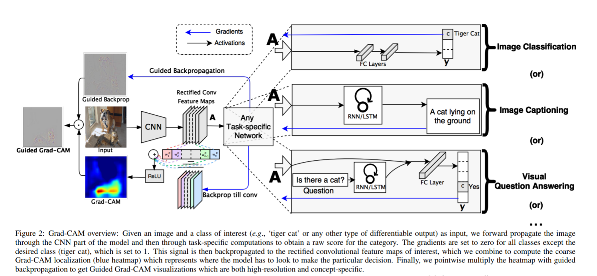


**Grad-CAM++**

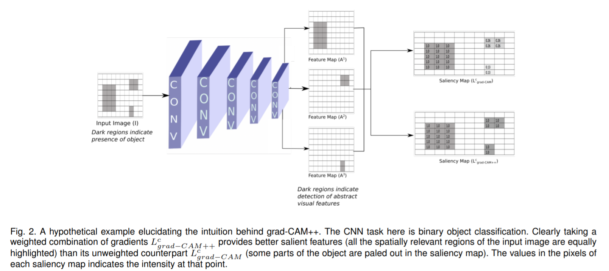


## Dependency

```wiki
python 3.6.x
pytoch 1.0.1+
torchvision 0.2.2
opencv-python
matplotlib
scikit-image
numpy
```


## Running the script

```shell
python main.py --image-path examples/pic1.jpg \
               --network densenet121 \
               --weight-path /opt/pretrained_model/densenet121-a639ec97.pth
```

**paras description**：

- image-path：saving path of your input image(default: `./examples/pic1.jpg`)

- network: choose a cnn models (default:`resnet50`)
- weight-path: the path of the weight 
- layer-name: the name used for the grad-CAM(default:the name of last cnn layer)


## Project Goal


### Use the Grad-CAM method to apply on different CNN models. Find out which network is effected when use the grad-CAM to localize. 
- Single object
- Multi-object

### Experiment Set up
#### Dowload the pre-train models
- VGG-16
- VGG-19
- resnet50
- resnet101
- densenet121
- inception_v3
- mobilenet_v2
- shufflenet_v2
- Apply Grad-CAM and Grad-CAM++ method on these cnn-based models

### Example: Single Object


**Original Image**


**Results**

| network      | HeatMap                                   | Grad-CAM                              | HeatMap++                                   | Grad-CAM++                              | Guided backpropagation               | Guided Grad-CAM                          |
| ------------ | ----------------------------------------- | ------------------------------------- | ------------------------------------------- | --------------------------------------- | ------------------------------------ | ---------------------------------------- |
| vgg16        | 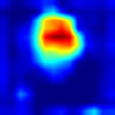       | 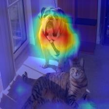       | 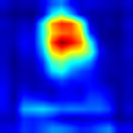       | 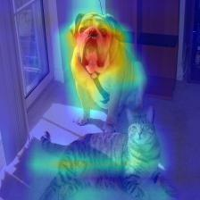       | 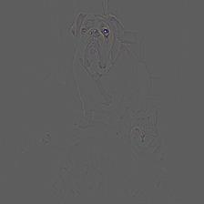       | 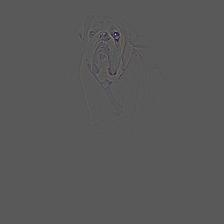       |
| vgg19        | 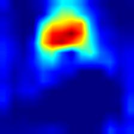       | 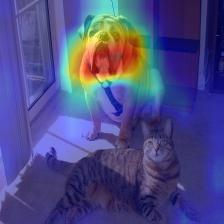       | 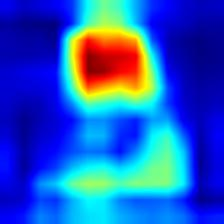       | 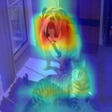       | 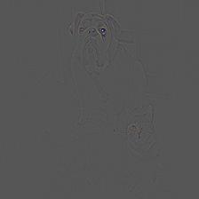       | 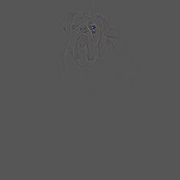       |
| resnet50     | 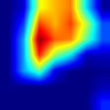    | 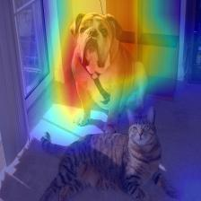    | 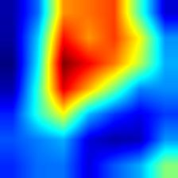    | 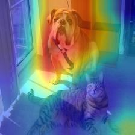    | 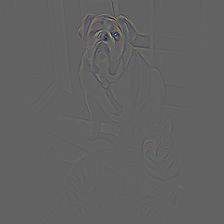    | 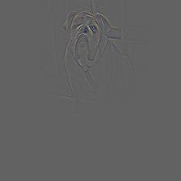    |
| resnet101    | 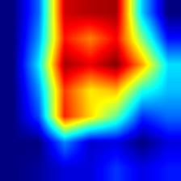   | 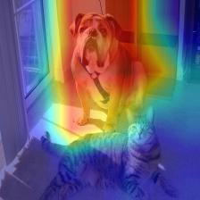   | 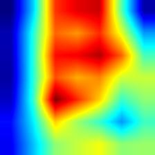   |     | 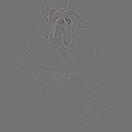   | 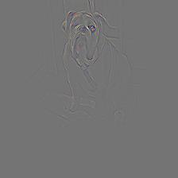   |
| densenet121  | 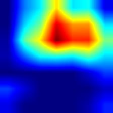 | 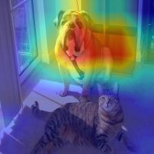 | 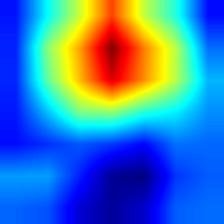 | 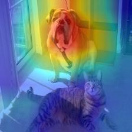 | 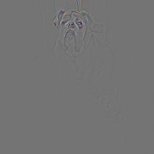 | 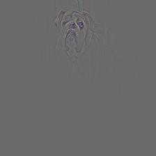 |
| inception_v3 | 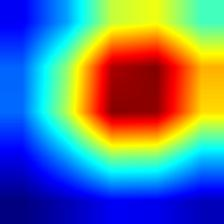   | 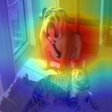   | 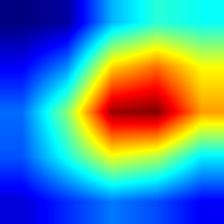   | 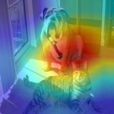   | 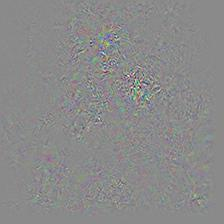   | 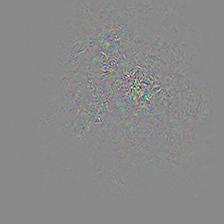   |
| mobilenet_v2 | 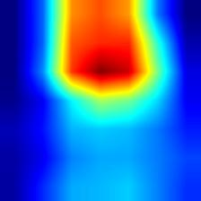   | 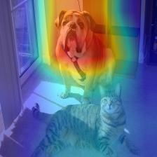   | 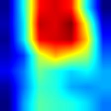   | 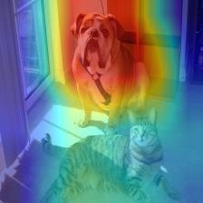   | 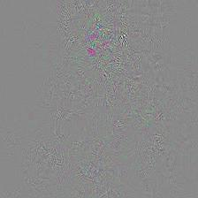   | 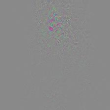   |
| shufflenet_v2 | 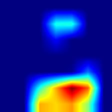   | 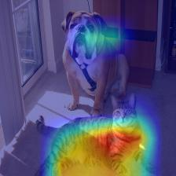   | 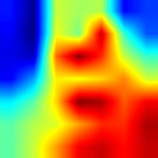   | 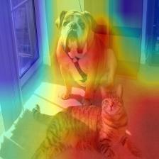   | 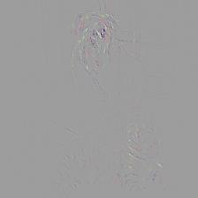   | 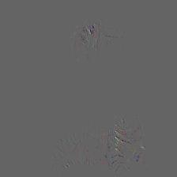   |

### Multi-Objects

- For multi-objects, Grad-CAM++ has a better localization than the Grad-CAM

**Original Image**


**Results**

| network      | HeatMap                                   | Grad-CAM                              | HeatMap++                                   | Grad-CAM++                              | Guided backpropagation               | Guided Grad-CAM                          |
| ------------ | ----------------------------------------- | ------------------------------------- | ------------------------------------------- | --------------------------------------- | ------------------------------------ | ---------------------------------------- |
| vgg16        | 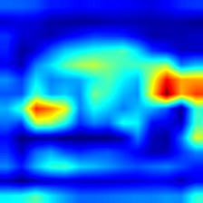       |        |        |        |        |        |
| vgg19        |        |        |        |        |        |        |
| resnet50     |     |     |     |     |     |     |
| resnet101    |    |    |    |     |    |    |
| densenet121  |  |  |  |  |  |  |
| inception_v3 |    |    |    |    |    |    |
| mobilenet_v2 |    |    |    |    |    |    |
| shufflenet_v2 |    |    |    |    |    |    |

 

## Conclusion

- The Grad-CAM of VGG models don't cover the whole class. But the resnet and denset has a larget localized region of the class. Also, their guild Grad-CAM have more clear stripes on the class. (densent > resnet > vgg)
- For multi-objects, Grad-CAM++ has cover more on the class than the Grad-CAM. Specifically, When there are same kind of objects(such as dogs class), the Grad-CAM only cover part of the target, but Grad-CAM++ can cover the whole class.
- MobileNet V2 is doing well in the Grad-CAM


## Reference
[Grad-CAM:Visual Explanations from Deep Networks via Gradient-based Localization](https://arxiv.org/pdf/1610.02391)

[Grad-CAM++: Improved Visual Explanations for Deep Convolutional Networks](https://arxiv.org/pdf/1710.11063.pdf)


